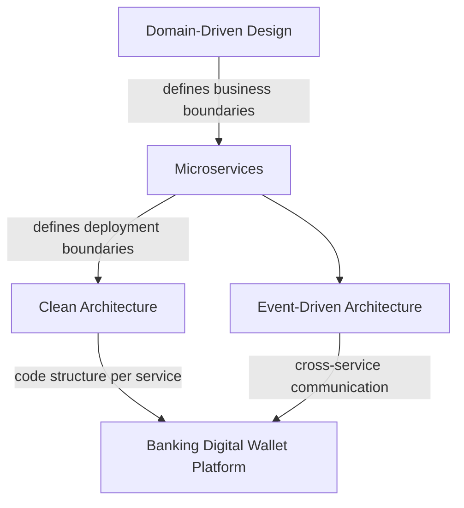
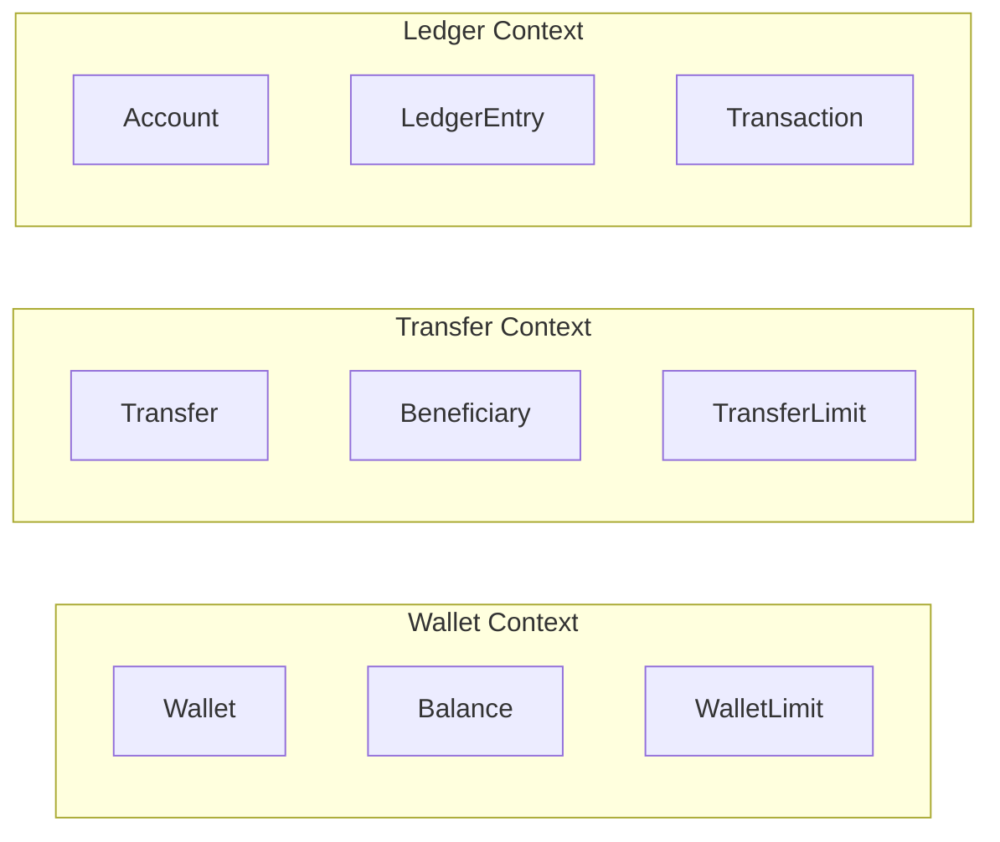
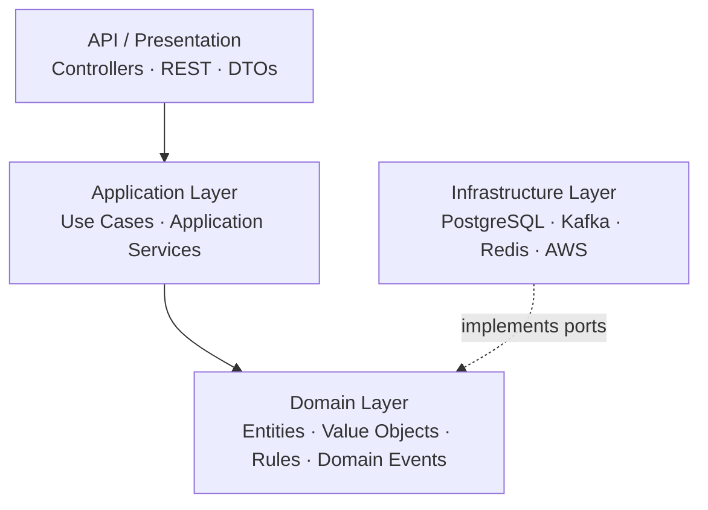
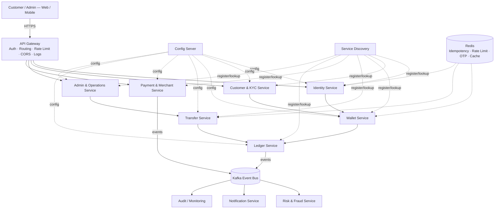
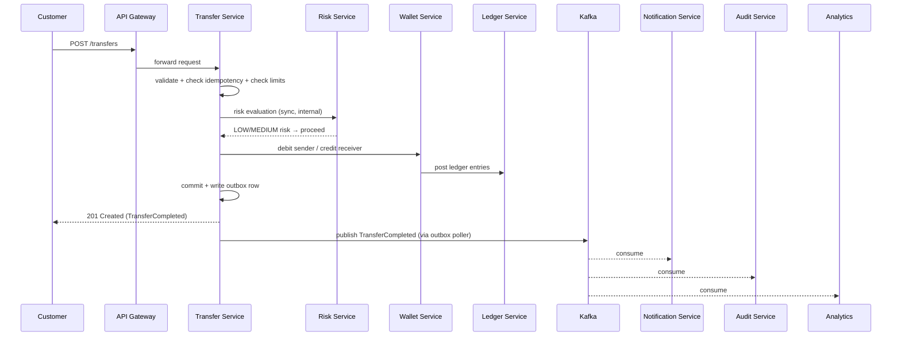
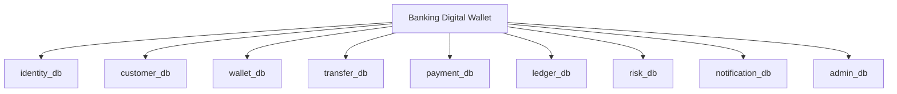

# Architecture Document — Banking Digital Wallet Platform

**Status:** Approved for Phase 0
**Scope:** Consolidates `1__Architecture.md`, `2__ServiceDecomposition.md`, `3__DatabaseDesign.md`, `4__EventDesign.md` into a single reference architecture.

---

## 1. Executive Summary

The platform is built as **8 business microservices + 3 infrastructure components**, decomposed using **Domain-Driven Design**, implemented with **Clean Architecture** per service, communicating via **REST (synchronous)** and **Kafka (asynchronous)**, each owning its own **PostgreSQL database**.



| Decision | Verdict | Core Reason |
|---|---|---|
| Domain-Driven Design | **Essential** | 15 distinct sub-domains (Identity, KYC, Wallet, Ledger, Transfer, Payment, Fraud, Settlement, etc.) with different rules, data ownership, and transaction semantics — a single shared model would collapse under this complexity |
| Microservices | Adopted | Sub-domains have clear boundaries and independently varying load (Payment traffic ≠ Admin traffic) |
| Clean Architecture | Adopted (per service) | Keeps financial business rules free of framework/infra dependencies — critical for testability of money-movement logic |
| Event-Driven (Kafka) | Adopted for side effects | Decouples the transaction path from notification/audit/fraud/analytics consumers |
| REST | Adopted for request/response | Used wherever the caller needs an immediate answer (place an order, get a balance) |

---

## 2. Bounded Contexts

DDD analysis identified 15 sub-domains, grouped into 8 deployable services where responsibilities, transaction boundaries, and security requirements naturally cluster:



Each bounded context keeps its own model — a `Transfer` in the Transfer context is a workflow/status object; a `Transaction` in the Ledger context is an immutable accounting fact. They are related but never the same class.

---

## 3. Service Map

### 3.1 Business Services (8)

| # | Service | Responsibility | Database |
|---|---|---|---|
| 1 | **Identity** | Registration, login, JWT, refresh tokens, OTP, sessions | `identity_db` |
| 2 | **Customer & KYC** | Customer profile, KYC applications & documents | `customer_db` |
| 3 | **Wallet** | Wallet, balance, deposit, withdrawal, limits | `wallet_db` |
| 4 | **Transfer** | P2P transfers, beneficiaries, transfer workflow | `transfer_db` |
| 5 | **Payment & Merchant** | Merchant onboarding, payments, QR, refunds | `payment_db` |
| 6 | **Ledger** | Double-entry accounting — system of record for money | `ledger_db` |
| 7 | **Risk & Notification** | Fraud detection, risk scoring, multi-channel notifications | `risk_db` / `notification_db` |
| 8 | **Admin & Operations** | RBAC, approvals, audit, back-office operations | `admin_db` |

### 3.2 Infrastructure Components (3)

| # | Component | Role |
|---|---|---|
| 9 | **API Gateway** | Single entry point — routing, JWT validation, rate limiting, CORS, correlation IDs |
| 10 | **Config Server** | Centralized configuration (DB, Kafka, Redis, JWT, feature flags) |
| 11 | **Service Discovery** | Service registration/lookup (Eureka, or platform-native on AWS/K8s) |

### 3.3 Clean Architecture (applied inside every business service)



**Dependency rule:** `Controller → Application → Domain ← Infrastructure`. The Domain layer never imports Spring, PostgreSQL, Kafka, Redis, or AWS SDKs — this is what makes the money-movement logic unit-testable in isolation and portable if infrastructure changes.

**Worked example — Transfer Service:**
- **Presentation:** `TransferController` → `POST /api/v1/transfers`
- **Application:** `CreateTransferUseCase` orchestrates: validate request → find sender → find recipient → check balance → check limits → fraud evaluation → execute transfer → publish event
- **Domain:** `Transfer`, `Money`, `TransferLimit` — pure rules, no framework code
- **Infrastructure:** JPA repository adapters, Kafka producer, Redis idempotency store

---

## 4. High-Level Architecture



**Gateway routing table:**
```
/api/v1/auth/**       → Identity Service
/api/v1/customers/**  → Customer & KYC Service
/api/v1/wallet/**     → Wallet Service
/api/v1/transfers/**  → Transfer Service
/api/v1/payments/**   → Payment & Merchant Service
/api/v1/admin/**      → Admin & Operations Service
```
Ledger and Risk expose **internal-only** APIs (`/internal/v1/...`) — never routed through the public gateway.

---

## 5. Communication Patterns

| Pattern | Transport | Used for | Example |
|---|---|---|---|
| **Synchronous** | REST | Anything the caller needs an immediate answer to | `POST /transfers` → validate → execute → response |
| **Asynchronous** | Kafka | Side effects that don't block the primary transaction | `TransferCompleted` → Notification, Audit, Risk, Analytics |

**Why not call every consumer synchronously?** Without events, `Transfer` would need direct knowledge of and a live call to Notification, Audit, Fraud, Reporting, and Analytics — tight coupling, and the transfer fails (or blocks) if any downstream service is slow or down. With events, `Transfer` publishes one fact and never needs to know who's listening.



---

## 6. Data Ownership & Consistency Strategy

**Database-per-service** — no service reads another service's tables directly. This is what makes independent deployment and scaling actually safe.



**No distributed database transactions across services.** A transfer touches Transfer, Wallet, and Ledger — each commits its own local transaction. Consistency across them is achieved through:

1. **Transactional Outbox** — each write to `transfers` (or `wallets`) and its corresponding `outbox_events` row happen in the *same* local DB transaction, so the event can never be lost even if Kafka is briefly unreachable.
2. **Outbox Publisher** — a scheduled job drains `outbox_events` and publishes to Kafka, at-least-once.
3. **Idempotent consumers** — every consumer checks `eventId` before processing (see §7), so at-least-once delivery never becomes duplicate processing.
4. **Eventual consistency for downstream views** — Ledger, Notification, Audit, and Risk update asynchronously within milliseconds-to-seconds of the transfer completing; the customer-facing transfer response itself is synchronous and authoritative.

```
Transfer DB transaction:
  transfers (write)
  outbox_events (write)
        │  same local COMMIT
        ▼
  Outbox Publisher (separate process) → Kafka
```

**Optimistic locking** — `wallets.version` prevents two concurrent requests (e.g. simultaneous withdrawal + transfer) from silently overwriting each other's balance update; a version mismatch forces a retry rather than a lost update.

---

## 7. Event-Driven Design Rules

Carried over verbatim from the event design analysis, since these are what keep the event backbone trustworthy long-term:

1. **Events are immutable** — corrections are new events (`TransferReversed`), never edits to a published event.
2. **Past tense naming** — `MoneyDeposited`, `TransferCompleted`, `PaymentRefunded`.
3. **Every event has a unique `eventId`** — mandatory, used for consumer-side dedup.
4. **Events are versioned** — `eventVersion` allows schema evolution without breaking existing consumers.
5. **Never expose sensitive data** — no passwords, password hashes, JWTs, refresh tokens, full card numbers, or CVVs in any event payload.
6. **Correlation IDs** — a single business request (e.g. one transfer) is traceable end-to-end via `correlationId` across Transfer → Wallet → Ledger → Notification → Audit.

**Standard event envelope:**
```json
{
  "eventId": "uuid",
  "eventType": "TransferCompleted",
  "eventVersion": 1,
  "occurredAt": "2026-08-24T10:00:00Z",
  "producer": "transfer-service",
  "correlationId": "uuid",
  "causationId": "uuid",
  "payload": { }
}
```

Full event catalog (35+ events across 9 domains) and per-topic layout live in the companion Event Design doc already produced — this architecture doc references it rather than duplicating it.

---

## 8. Security Architecture

| Concern | Approach |
|---|---|
| Authentication | Identity Service issues JWT access + refresh token pairs |
| Gateway enforcement | API Gateway validates JWT on every inbound request before routing |
| Authorization | RBAC (roles/permissions) enforced in Admin & Operations Service; `@PreAuthorize` checks per endpoint in each service |
| Service-to-service calls | Internal APIs (`/internal/v1/...`) not exposed via the gateway; scoped to the private network only |
| Sensitive data | Passwords hashed (BCrypt/Argon2); no PII/secrets in Kafka events; TLS everywhere |
| Rate limiting | Redis-backed, enforced at the Gateway and again on sensitive endpoints (auth, transfer) |
| Idempotency | `Idempotency-Key` header on all money-movement POSTs, backed by Redis / `idempotency_records` table |
| Sensitive operations | Maker-Checker (`approvals` table) — one admin requests, a second approves, for high-risk admin actions |

---

## 9. Technology Stack Mapping

| Layer | Technology |
|---|---|
| API / REST | Spring Boot, Spring Web |
| Security | Spring Security + JWT |
| Business logic | Java |
| Architecture | Clean Architecture + DDD |
| Database | PostgreSQL (database-per-service) |
| ORM | Spring Data JPA / Hibernate |
| Messaging | Apache Kafka |
| Cache | Redis |
| API Documentation | OpenAPI / Swagger |
| Testing | JUnit + Mockito + Testcontainers |
| Build | Maven |
| Containers | Docker |
| CI/CD | GitHub Actions |
| Monitoring | Spring Boot Actuator |
| Logging | SLF4J / Logback |
| Cloud | AWS |
| Gateway | Spring Cloud Gateway |
| Config | Spring Cloud Config Server |
| Discovery | Eureka (or platform-native on K8s) |

---

## 10. Repository & Project Layout

```
banking-digital-wallet/
├── api-gateway/
├── identity-service/
├── customer-kyc-service/
├── wallet-service/
├── transfer-service/
├── payment-merchant-service/
├── ledger-service/
├── risk-notification-service/
├── admin-operations-service/
├── config-server/
├── discovery-server/
├── infrastructure/
│   ├── docker/
│   ├── kafka/
│   ├── postgres/
│   └── redis/
└── docs/
    ├── architecture/
    ├── api/
    ├── domain/
    └── adr/
```

Each business service internally follows the Clean Architecture layout (`domain / application / infrastructure / presentation`) shown in §3.3.

---

## 11. Architecture Decision Log (ADR Summary)

| ID | Decision | Status | Rationale (short) |
|---|---|---|---|
| ADR-001 | Adopt DDD for domain modeling | Accepted | 15 sub-domains with divergent rules/data ownership |
| ADR-002 | Adopt Microservices over modular monolith | Accepted | Independent scaling (Payment vs Admin traffic), clear bounded contexts |
| ADR-003 | Adopt Clean Architecture per service | Accepted | Isolate financial rules from framework/infra churn |
| ADR-004 | Database-per-service, no cross-service joins | Accepted | Required for true service independence; enforced via API/events only |
| ADR-005 | Kafka for all cross-service side effects | Accepted | Decouples transaction path from notification/audit/fraud/analytics |
| ADR-006 | Transactional Outbox over dual-write | Accepted | Guarantees DB write and event publish never diverge |
| ADR-007 | No distributed (2PC) transactions | Accepted | Not supported cleanly across service/DB boundaries; eventual consistency accepted for non-critical-path consumers |
| ADR-008 | JWT auth validated at Gateway | Accepted | Single enforcement point, keeps services stateless |
| ADR-009 | Optimistic locking on wallet balance | Accepted | Prevents lost updates under concurrent debit/credit without heavy locking |
