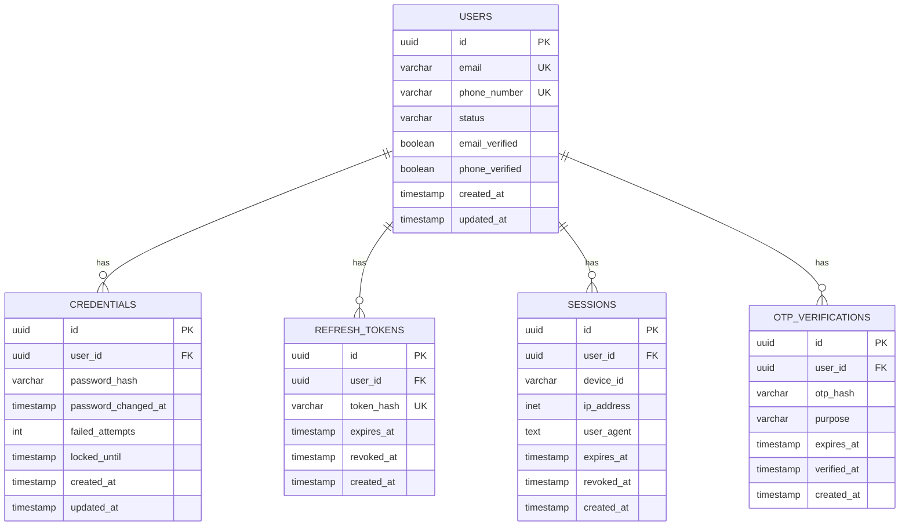
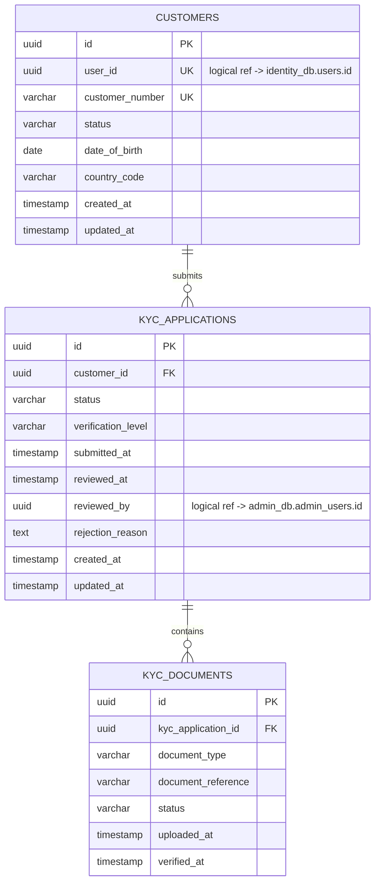
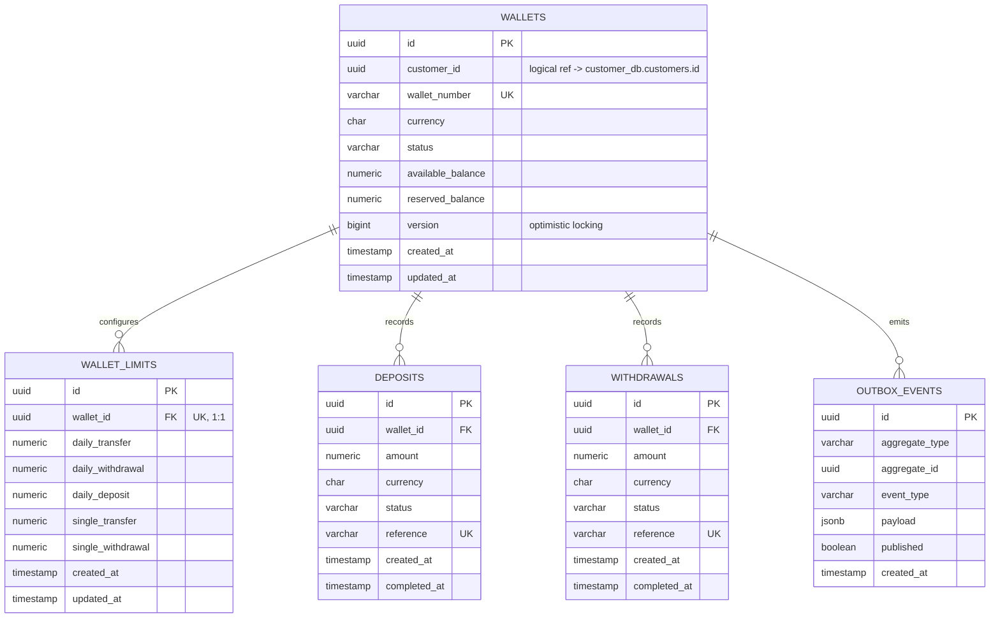
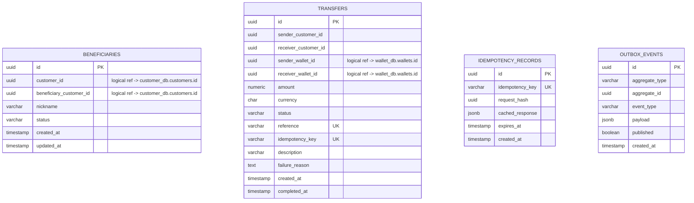
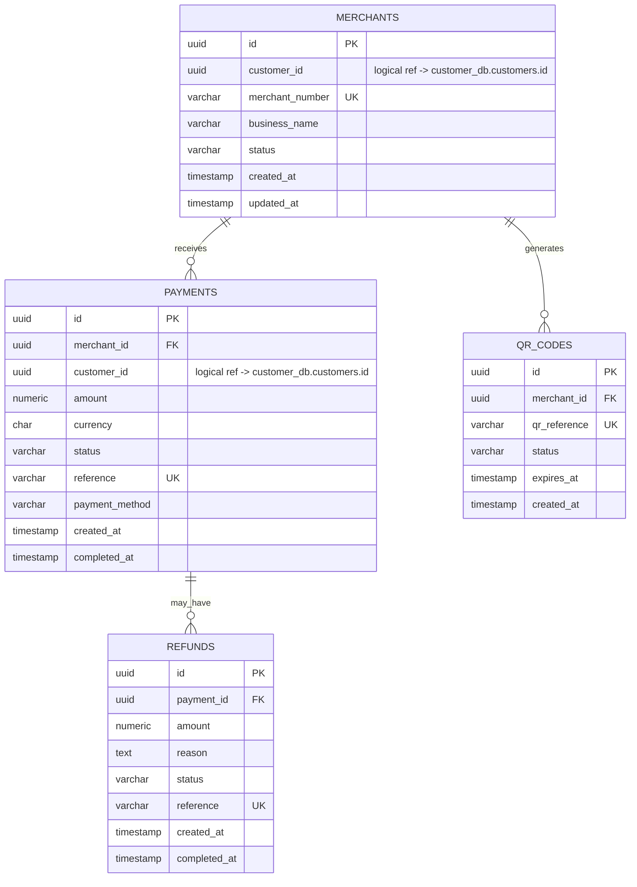
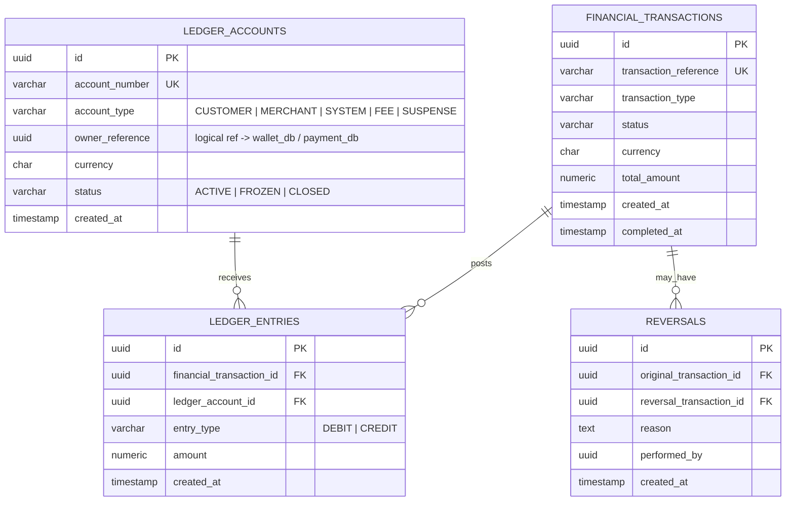
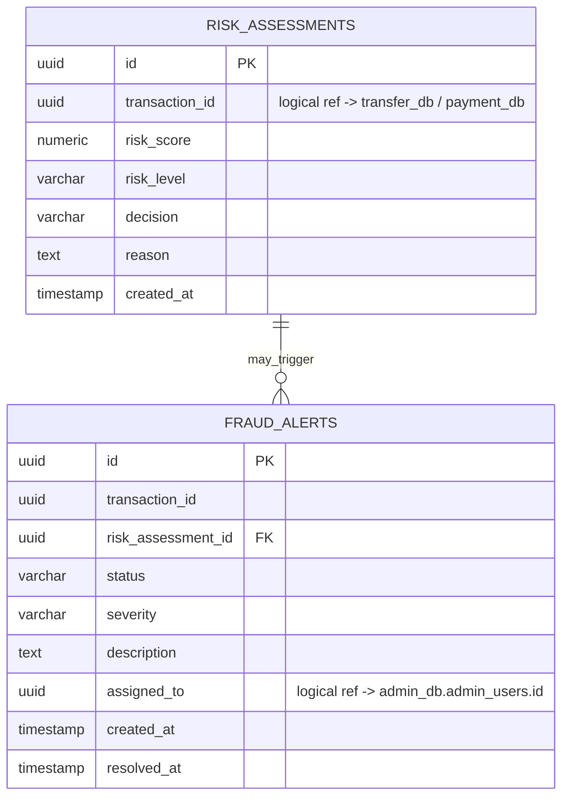
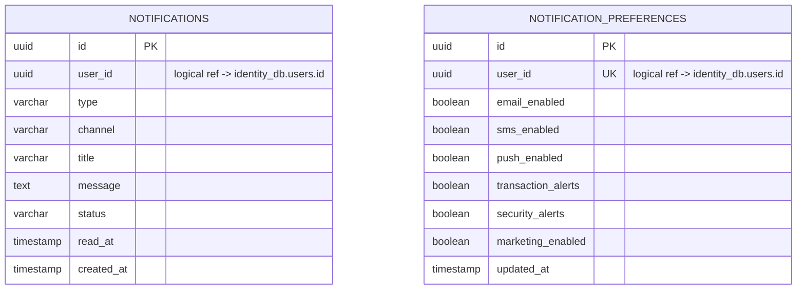
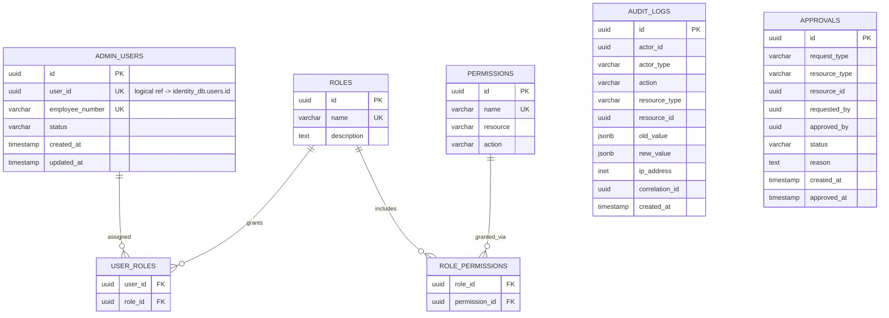
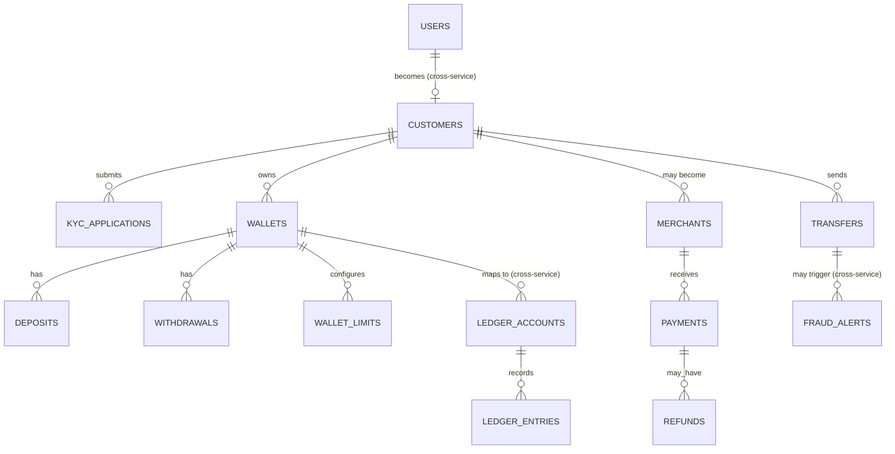

# ER Diagrams — Banking Digital Wallet Platform

Database-per-service means there are **no physical foreign keys across services** — a `wallet_id` referenced in `transfer_db` is a logical reference only, resolved via API calls or event payloads, never a SQL join. Each diagram below is one physically real, independently deployed PostgreSQL database. A cross-service logical reference map follows at the end.

---

## 1. `identity_db` — Identity Service



---

## 2. `customer_db` — Customer & KYC Service



---

## 3. `wallet_db` — Wallet Service



**Invariant enforced at the DB level:** `available_balance >= 0` and `reserved_balance >= 0` (CHECK constraints) — the balance itself is a snapshot column here (unlike the Ledger service's derived-from-entries model), reconciled against `ledger_db` asynchronously via `MoneyDeposited` / `MoneyWithdrawn` events.

---

## 4. `transfer_db` — Transfer Service



**Constraints of note:** `chk_transfer_amount CHECK (amount > 0)`, `chk_transfer_not_self CHECK (sender_customer_id <> receiver_customer_id)`, unique `(customer_id, beneficiary_customer_id)` pair on beneficiaries.

---

## 5. `payment_db` — Payment & Merchant Service



---

## 6. `ledger_db` — Ledger Service (system of record for money)



**Core invariant:** for every `financial_transaction_id`, `SUM(amount WHERE entry_type='DEBIT') = SUM(amount WHERE entry_type='CREDIT')`. Entries are append-only — corrections happen exclusively through a `REVERSALS` row plus a brand-new offsetting `FINANCIAL_TRANSACTIONS` entry, never an `UPDATE`/`DELETE` on existing entries.

*Example — transfer of 10,000 THB:*
```
Sender Account      DEBIT   10,000
Receiver Account    CREDIT  10,000
                    Balanced ✓
```

---

## 7. `risk_db` — Risk Service



---

## 8. `notification_db` — Notification Service



---

## 9. `admin_db` — Admin & Operations Service



**Maker-Checker pattern** for sensitive operations: Admin A raises an `APPROVALS` row → Admin B reviews and approves/rejects. No single admin can unilaterally execute a sensitive action (e.g. force-unfreeze a wallet).

---

## 10. Cross-Service Logical Reference Map

Since there are no physical foreign keys between services, this table is the source of truth for how records relate across the platform. Consumers must resolve these via API call or the event payload that originally carried the ID — never via direct DB query.

| From (service.table.column) | Logically references | Resolved via |
|---|---|---|
| `customer_db.customers.user_id` | `identity_db.users.id` | `CustomerCreated` event carries `userId` |
| `wallet_db.wallets.customer_id` | `customer_db.customers.id` | `CustomerCreated` / `KycApproved` event |
| `transfer_db.transfers.sender_wallet_id` | `wallet_db.wallets.id` | Transfer Service calls Wallet Service API at transfer time |
| `ledger_db.ledger_accounts.owner_reference` | `wallet_db.wallets.id` or `payment_db.merchants.id` | `WalletCreated` / `MerchantApproved` event |
| `risk_db.fraud_alerts.assigned_to` | `admin_db.admin_users.id` | Admin Service API (assignment action) |
| `notification_db.notifications.user_id` | `identity_db.users.id` | Carried in every domain event's `userId`/`customerId` field |
| `admin_db.audit_logs.actor_id` | `identity_db.users.id` or `admin_db.admin_users.id` | Carried in request context / JWT claims |

---

## 11. High-Level Cross-Domain Overview



This diagram spans 9 physical databases — it exists purely to communicate the platform's logical data model to reviewers, and does **not** represent an executable schema or a shared database.
